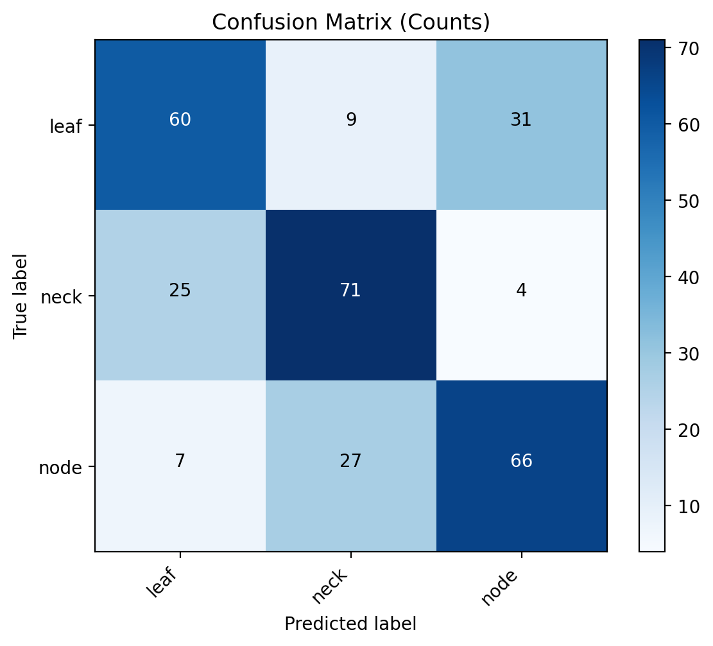
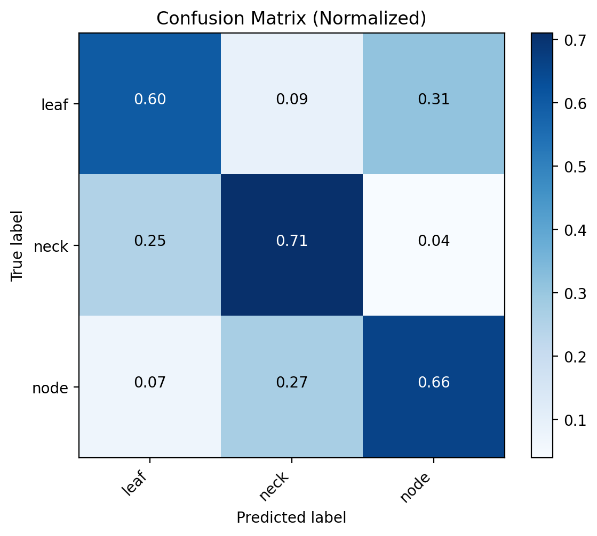
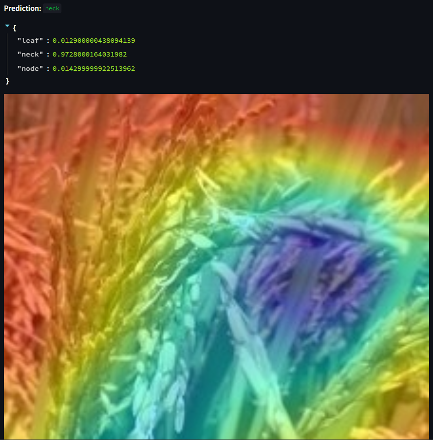

# 🌿 Leaf–Neck–Node Classifier

A deep learning project to classify rice plant diseases (Leaf, Neck, Node) using **PyTorch**, **Grad-CAM** for explainability, and a **Streamlit** web app for deployment.

---

## 🚀 Features
- Balanced training with **WeightedRandomSampler**
- Strong data augmentation (color jitter, blur, rotation)
- **Label smoothing** + **MixUp** regularization
- Backbones: `ResNet18` 
- **Test evaluator**: confusion matrix, classification report, per-image CSV
- **Streamlit app** with optional **TTA** (test-time augmentation, hflip)

---

## 📊 Results

| Class | Precision | Recall | F1-score | Support |
|-------|-----------|--------|----------|---------|
| Leaf  | 0.65      | 0.60   | 0.62     | 100     |
| Neck  | 0.66      | 0.71   | 0.69     | 100     |
| Node  | 0.65      | 0.66   | 0.66     | 100     |

- **Overall Accuracy:** `66%` (baseline ResNet18, 30 epochs, img_size=256)  
- Confusion matrices (counts + normalized) are saved in `exports/`.

## Results





## 🖥️ Streamlit App




- Upload an image (`.jpg`/`.png`)
- Model predicts **Leaf / Neck / Node**
- Grad-CAM heatmap highlights important regions
- Optionally enable **TTA (hflip)** for more robust predictions


---

## 🔧 Usage

```bash
# 1. Create environment
python -m venv .venv && source .venv/bin/activate   # Windows: .venv\\Scripts\\activate
pip install -r requirements.txt

# 2. Configure dataset path
# Edit config.yaml (expects data/train, data/val, data/test)

# 3. Train
python -m src.train --config config.yaml

# 4. Evaluate
python -m src.test --config config.yaml --weights models/best.pt --classes models/classes.txt

# 5. Launch app
streamlit run app/streamlit_app.py

leaf-neck-node-classifier/
│
├── app/
│   └── streamlit_app.py        # Streamlit interface
├── src/
│   ├── data.py                 # Data loaders + augmentations
│   ├── model.py                # Backbone models
│   ├── train.py                # Training loop with MixUp
│   ├── test.py                 # Evaluator (CM, report, CSV)
│   ├── predict.py              # CLI inference
│   ├── gradcam.py              # Grad-CAM implementation
│   └── utils.py                # Helpers
├── exports/                    # Confusion matrices, reports, CSVs
├── models/                     # Saved weights + classes.txt
├── config.yaml                 # Config file
├── requirements.txt
├── README.md
└── .gitignore